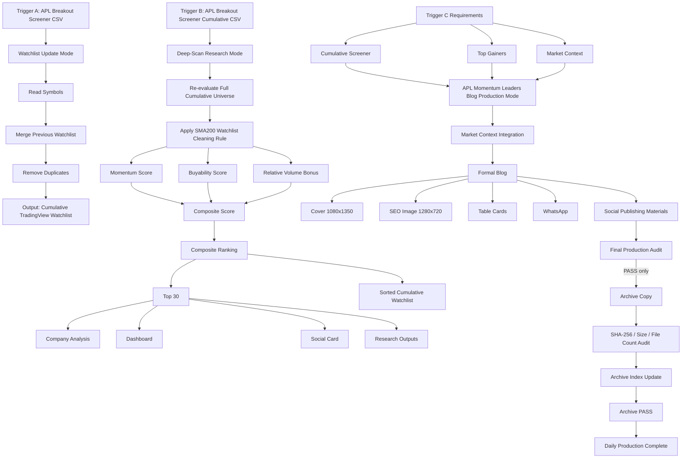

# APL US Stock Production Workflow Specification v1.0

This document defines the production workflow for the APL US Stock system.

It separates data collection, Deep-Scan research, and formal Blog production into three explicit triggers.

## Highest Priority Rule

```text
Any Screener CSV alone must not trigger full Blog production.
```

---

# Trigger A｜Watchlist Update Mode

## Trigger

Upload:

```text
APL Breakout Screener_YYYY-MM-DD_*.csv
```

## Input

```text
APL Breakout Screener CSV
```

## Mode

```text
Watchlist Update Mode
```

## Processing

```text
Input
↓
Read Symbols
↓
Merge with Previous Cumulative Watchlist
↓
Remove Duplicates
↓
Output Cumulative TradingView Watchlist
```

## Output

```text
APL_Quant_Cumulative_Watchlist_YYYY-MM-DD.txt
```

## Required Behavior

- Update cumulative TradingView Watchlist.
- Add new symbols only.
- Remove duplicates.
- Do not trigger SMA200 removal.
- Do not trigger scoring.
- Do not trigger research package.
- Do not trigger formal content production.

## Forbidden Actions

Trigger A must not produce:

- SMA200 Removal
- Composite Score
- Full Ranking CSV
- Top 30
- Company Analysis
- Dashboard
- Social Card
- Formal Blog
- Blog Cover
- SEO Image
- Table Cards
- WhatsApp formal publishing post
- Social Publishing Materials

---

# Trigger B｜Deep-Scan Research Mode

## Trigger

Upload:

```text
APL Breakout Screener Cumulative_YYYY-MM-DD_*.csv
```

## Input

```text
APL Breakout Screener Cumulative CSV
```

## Mode

```text
Deep-Scan Research Mode
```

## Processing

```text
Input
↓
Re-evaluate Full Cumulative Universe
↓
Apply SMA200 Watchlist Cleaning Rule
↓
Score Calculation
↓
Composite Score
↓
Ranking
↓
Top 30
↓
Company Analysis
↓
Dashboard / Social Card
↓
Research Outputs
```

## SMA200 Watchlist Cleaning Rule

```text
If SMA200 is valid and Price < SMA200
→ Remove from Watchlist

If SMA200 is missing, zero, invalid, or unavailable
→ Keep in Watchlist
```

## Score Components

```text
Momentum Score
Buyability Score
Relative Volume Bonus
Composite Score
```

## Composite Score

Current formula:

```text
Composite Score
= Momentum Score
+ Buyability Score
+ Relative Volume Bonus

Relative Volume Bonus = min(Raw Relative Volume Bonus, Buyability Score)
```

## Output

Trigger B may produce:

- Composite Score
- Ranking
- Top 30
- Full Ranking CSV
- Cumulative TradingView Watchlist
- Dashboard
- Social Card
- Company Analysis
- Research Outputs
- Basic research summary

## Forbidden Actions

Trigger B must not produce the formal Blog package unless Trigger C requirements are satisfied.

Trigger B alone must not produce:

- Formal Blog
- Blog Cover
- SEO Image
- Blog Table Cards
- Final WhatsApp publishing post
- Full Social Publishing Materials

---

# Trigger C｜APL Momentum Leaders Blog Production Mode

## Trigger Condition

Trigger C requires:

```text
APL Breakout Screener Cumulative
+
最近7日 Top Gainers
+
Market Context
```

## Mode

```text
Formal Blog Production Mode
```

## Processing

```text
Deep-Scan Research Output
↓
Top Gainers
↓
Market Context
↓
Formal Blog
↓
Cover
↓
SEO Image
↓
Table Cards
↓
WhatsApp / Social Publishing Materials
↓
Final Production Audit
↓ PASS only
Archive Copy
↓
SHA-256 / Size Audit
↓
Archive Index Update
↓
Daily Production Complete
```

## Output

Trigger C may produce:

- Formal Blog
- Cover
- SEO Image
- Table Cards
- WhatsApp
- Social Publishing Materials
- Archive package

---

# Input / Output Matrix

| Input | Watchlist | Scoring | Ranking | Top 30 | Dashboard | Social Card | Company Analysis | Blog | Cover | SEO | Table Cards | WhatsApp | Archive |
|---|---:|---:|---:|---:|---:|---:|---:|---:|---:|---:|---:|---:|---:|
| APL Breakout Screener | Yes | No | No | No | No | No | No | No | No | No | No | No | No |
| APL Breakout Screener Cumulative | Yes | Yes | Yes | Yes | Yes | Yes | Yes | No | No | No | No | No | Required after complete Production PASS |
| Top Gainers only | No | No | No | No | No | No | No | No | No | No | No | No | No |
| Market Context only | No | No | No | No | No | No | No | No | No | No | No | No | No |
| Cumulative + Top Gainers + Market Context | Yes | Yes | Yes | Yes | Yes | Yes | Yes | Yes | Yes | Yes | Yes | Yes | Yes |

---

# Forbidden Actions Matrix

| Mode | Forbidden Actions |
|---|---|
| Watchlist Update Mode | Must not run SMA200 removal, calculate scores, rank Top 30, create Dashboard, create Social Card, create Blog, create Cover, create SEO image, create Table Cards |
| Deep-Scan Research Mode | Must not create Formal Blog, Cover, SEO Image, Blog Table Cards, final WhatsApp publishing post, or full Social Publishing Materials unless Trigger C requirements are met |
| Top Gainers Input Only | Must not trigger scoring, Watchlist update, Dashboard, Blog, or Social package |
| Market Context Input Only | Must not trigger scoring, Watchlist update, Dashboard, Blog, or Social package |

---

# Production Flow Diagram



---

# Production Completion and Automatic Archive

每次當日 Production 完整 PASS 後，workflow 必須自動執行 Archive，不等待使用者額外指示。

```text
Production PASS
→ Final Production Audit PASS
→ Archive/YYYY/YYYY-MM-DD copy
→ relative path / file count / bytes / SHA-256 verification
→ Archive/index.md update
→ Archive PASS
→ Daily Production Complete
```

Archive 來源固定為 `outputs/YYYY-MM-DD/`。正式檔案與必要 audit/logs 必須保留；staging、temporary inputs、cache、diagnostics 與重複中間檔必須排除。來源只 Copy，不 Move／Delete。規則細節以 `KnowledgeBase/Rules/APL_US_Stock_Archive_Rules.md` 為準。

Archive v2 adoption由 tracked `tools/archive-v2-policy.json` 控制。有效 v2日期在 index標記 `PASS`；只有 adoption前且精確 allowlisted、沒有 v2 manifest的歷史目錄可標記 `LEGACY_UNVERIFIED`。Legacy inventory統計不構成完整性證明，亦不可阻擋新的有效 v2 Archive。未知舊日期或 adoption後日期缺／壞 manifest必須 fail-fast。

Git Commit／Push 不得負責 Archive，Production runner 亦不自動 Commit／Push。
